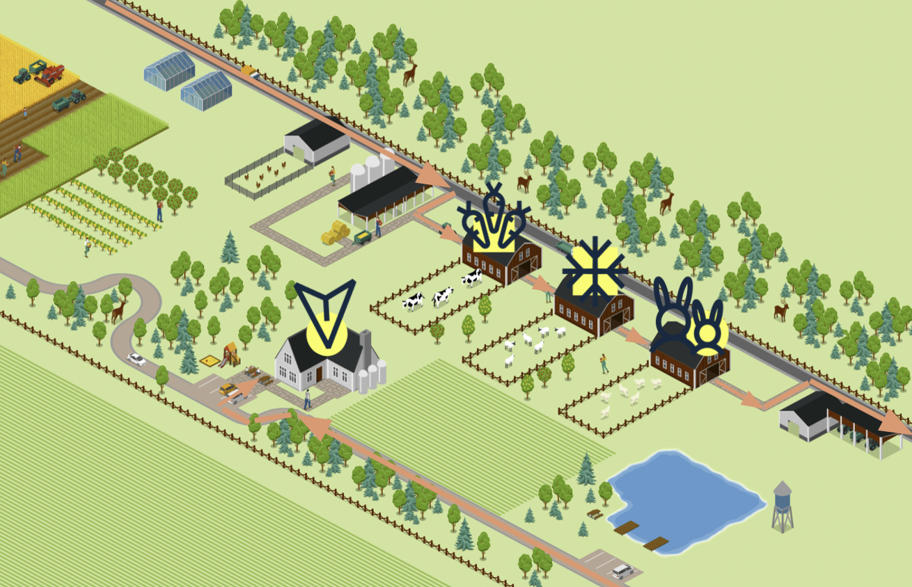

# Farmshare

Welcome to the Farmshare 👩🏻‍🌾! A fictitious logistics company that delivers fresh
goods from local farms to customer’s homes.

The apps are hosted, managed and versioned by [Nextmv](https://nextmv.io/).

* [Vehicle routing](./vehicle-routing): Optimize the routes of a
  fleet of vehicles to deliver goods to customers.
* [Shift assignment](./shift-assignment): Assign shifts to farm
  drivers to cover the demand of the business.
